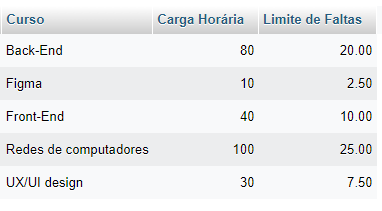
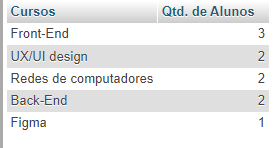
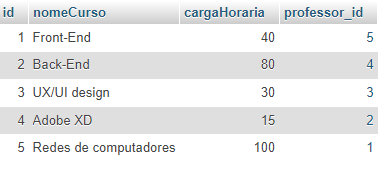
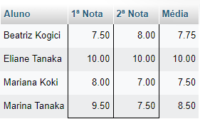

# 1 - Fazendo uma Query(Consulta) que mostra alunos nascidos antes de 2009.

```sql
SELECT 
nomeAluno as Aluno, 
nascimento as Nascimento 
FROM alunos 
WHERE Nascimento < '2009-01-01' 
GROUP BY Aluno;
```

***Resultado***


---

# 2 - Fazendo uma Query(Consulta) que calcula a média de cada aluno.

```sql
SELECT 
nomeAluno as Aluno,
nota1 as "1ª Nota", 
nota2 as "2ª Nota",
ROUND((nota1 + nota2) / 2 ,2) as Média
FROM alunos
GROUP BY Aluno;
```

***Resultado***


---


# 3 - Fazendo uma Query(Consulta) que calcula o limite de faltas de cada curso de acordo com a carga horária, o limite como 25% da carga horária e classificando em ordem crescente pelo nome do curso.

```sql
SELECT
nomeCurso as Curso,
cargaHoraria as "Carga Horária",
cargaHoraria * 0.25 as "Limite de Faltas"
FROM cursos
GROUP BY Curso;

``` 
***Resultado***



 **Versão com ROUND(Arredondado)**

```sql
SELECT
nomeCurso as Curso,
cargaHoraria as "Carga Horária",
ROUND(cargaHoraria * 0.25) as "Limite de Faltas"
FROM cursos
GROUP BY Curso;

``` 


---

# 4 - Fazendo uma Query(Consulta) que mostra os nomes dos professores que são somente da área "desenvolvimento".

```sql
SELECT
nomeProf as Prof,
materia as Matéria
FROM professores
WHERE materia LIKE "%desenvolvimento%";
```

***Resultado***


---

# 5 - Fazendo uma Query(Consulta) que mostra a quantidade de professores que cada matéria possui.

**Primeira versão**

```sql
SELECT
nomeCurso as Curso, 
COUNT(professor_id) as Professores 
FROM cursos
GROUP BY Curso;

```


***Resultado***


**Segunda versão**

```sql
SELECT
materia as Área,
COUNT (*) as "Qtd. de Professores"
FROM professores
GROUP BY Área;
```

***Resultado***


---

# 6 - Fazendo uma Query(Consulta) que mostra o nome dos alunos, a matéria e a carga horária dos cursos que fazem.

```sql
SELECT
alunos.nomeAluno as Aluno,
cursos.nomeCurso as Matéria,
cursos.cargaHoraria as "Carga Horária"
FROM alunos INNER JOIN cursos
ON alunos.curso_id = cursos.id
ORDER BY Aluno;

```

***Resultado***


---

# 7 - Fazendo uma Query(Consulta) que mostra o nome dos professores e o nome do curso que lecionam. Classifique pelo nome do professor.

```sql
SELECT
professor.nomeProf as Professor,
cursos.nomeCurso as Curso
FROM professores INNER JOIN cursos
ON professores.curso_id = cursos.id
ORDER BY Professor;

```

***Resultado***


---

# 8 - Fazendo uma Query(Consulta) que mostra o nome dos alunos, a matéria dos cursos que fazem, e o professor de cada curso.

```sql
SELECT
alunos.nomeAluno as Aluno,
cursos.nomeCurso as Curso,
professores.nomeProf as Professor
FROM alunos INNER JOIN cursos 
ON alunos.curso_id = cursos.id
INNER JOIN professores
ON cursos.professor_id = professores.id    
GROUP BY Aluno;
```

***Resultado***


---

# 9 - Fazendo uma Query(Consulta) que mostra a quantidade de alunos que cada curso possuie classificando-os em ordem decrescente de acordo com a quantidade de alunos.

```sql
SELECT
cursos.nomeCurso as Cursos,
COUNT(curso_id) as "Qtd. de Alunos"
FROM cursos INNER JOIN alunos
ON alunos.curso_id = cursos.id
GROUP BY Cursos
ORDER BY COUNT(alunos.curso_id) DESC;
```

***Resultado***



---

# 10 - Fazendo uma Query(Consulta) que mostra o nome dos alunos, suas notas, médias e o nome do curso que fazem. Devem ser considerados somente os alunos de Front-End e Back-End. Mostre os resultados classificados pelo nome do aluno.

```sql
SELECT
alunos.nomeAluno as Aluno,
nota1 as "1ª Nota", 
nota2 as "2ª Nota",
ROUND((nota1 + nota2) / 2 ,2) as Média,
cursos.nomeCurso as Cursos
FROM alunos INNER JOIN cursos
ON alunos.curso_id = cursos.id
WHERE curso_id IN (1,2)
GROUP BY Aluno;
```

***Resultado***


---

# 11 - Fazendo uma Query(Update) que altera o nome do curso de Figma para Adobe XD e sua carga horária de 10 para 15.

**Método via UPDATE**

```sql
UPDATE cursos 
SET nomeCurso = "Adobe XD", cargaHoraria = "15"
WHERE id = 4;
```

***Resultado***




**Método via SELECT**
```sql
SELECT
nomeCurso as "Curso Antigo",
'Adobe XD' as "Curso Novo",
cargaHoraria as "Carga Horária Antiga",
15 as "Carga Horária"
FROM cursos
WHERE id = 4;
```

***Resultado***


---


# 12 - Fazendo uma Query(Delete) que exclua um aluno do curso de Redes de Computadores e um aluno do curso de UX/UI.

```sql
DELETE FROM alunos WHERE id IN (6,7);
```

***Resultado***


---

# 13 - Fazendo uma Query(Consulta) que mostra a lista de alunos atualizada e o nome dos cursos que fazem, classificados pelo nome do aluno.

```sql
alunos.nomeAluno as Alunos,
cursos.nomeCurso as Cursos
FROM cursos INNER JOIN alunos
ON cursos.id = alunos.curso_id
GROUP BY Alunos;
```

***Resultado***


---

## DESAFIOS !

## 1 - Fazendo uma Query(Consulta) que calcula a idade do aluno.

```sql
SELECT 
nomeAluno as Aluno,
nascimento as "Data de Nascimento",
FLOOR(DATEDIFF(CURRENT_DATE, nascimento) / 365.25) as Idade
FROM Alunos
GROUP BY Aluno;
```

***Resultado***


---

## 2 - Fazendo uma Query(Consulta) que calcula a média das notas de cada aluno e mostre somente os alunos que tiveram a média maior ou igual a 7.

```sql
SELECT 
nomeAluno as Aluno,
nota1 as "1ª Nota", 
nota2 as "2ª Nota",
ROUND((nota1 + nota2) / 2 ,2) as "Média"
FROM alunos
WHERE ROUND((nota1 + nota2) / 2 ,2) >= 7
GROUP BY nomeAluno;
```

***Resultado***



---

## 3 - Fazendo uma Query(Consulta) que calcula a média das notas de cada aluno e mostre somente os alunos que tiveram a média menor que 7.

```sql
SELECT 
nomeAluno as Aluno,
nota1 as "1ª Nota", 
nota2 as "2ª Nota",
ROUND((nota1 + nota2) / 2 ,2) as "Média"
FROM alunos
WHERE ROUND((nota1 + nota2) / 2 ,2) < 7
GROUP BY nomeAluno;
```

***Resultado***


---

## 4 - Fazendo uma Query(Consulta) que mostra a quantidade de alunos com média maior ou igual a 7.

**Primeira Versão**

```sql
SELECT 
COUNT(nomeAluno) as Alunos,
nota1 as "1ª Nota", 
nota2 as "2ª Nota",
ROUND((nota1 + nota2) / 2 ,2) as "Média"
FROM alunos
WHERE ROUND((nota1 + nota2) / 2 ,2) >= 7
GROUP BY nomeAluno;

```
***Resultado***


**Segunda Versão**

```sql
SELECT 
COUNT(alunos.nomeAluno) as 'Quantidade de alunos' 
FROM alunos WHERE ROUND((nota1 + nota2)/2,2) >= 7 ;
```

***Resultado***

